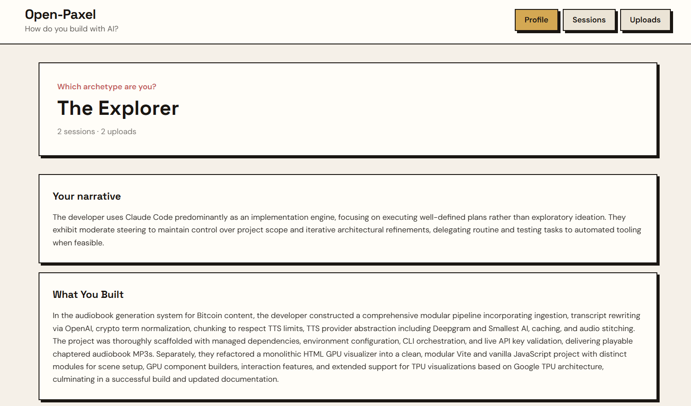
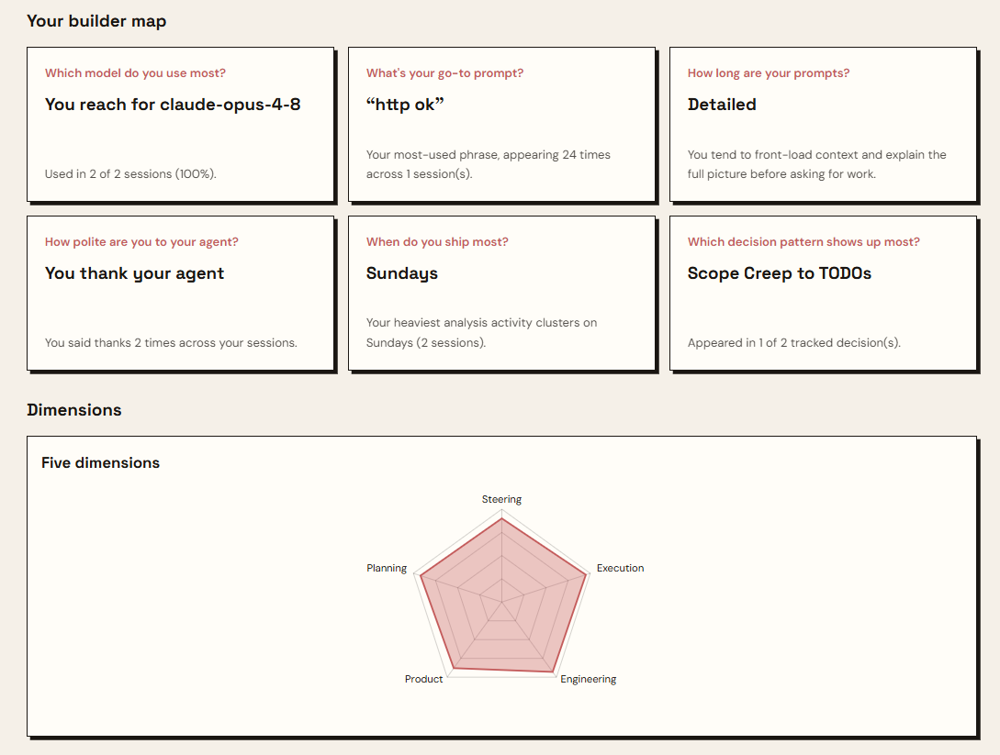

<p align="center">
  
</p>

# Open-Paxel

Local-first, open [Paxel](https://paxel.ycombinator.com/)-style analyzer for **Claude Code** sessions. Builds a historical builder profile across five dimensions (steering, execution, engineering, product instinct, and planning) with narrative sections, decision patterns, insight cards, and a neobrutalism dashboard.

**Privacy:** transcripts stay on your machine. Only redacted excerpts go to **your OpenAI API key**. Scores are stored locally in SQLite (`~/.open-paxel/profile.db`).

## Preview

<p align="center">
  
</p>

<p align="center">
  
</p>

## Prerequisites

- [uv](https://docs.astral.sh/uv/) for Python env and CLI tooling
- [Node.js](https://nodejs.org/) only if you run the frontend dev server
- An [OpenAI API key](https://platform.openai.com/api-keys)
- Claude Code sessions under `~/.claude/projects/` (for CLI discovery)

```bash
curl -LsSf https://astral.sh/uv/install.sh | sh
# Windows PowerShell:
irm https://astral.sh/uv/install.ps1 | iex
```

## Install

From the repo root:

```bash
uv sync --all-groups          # creates .venv + installs deps
cp .env.example .env          # then add OPENAI_API_KEY=sk-...
```

**Optional:** install the CLI globally so you can run `open-paxel` from any project folder:

```bash
cd path/to/open-paxel
uv tool install --editable .
```

After that, `open-paxel discover` works from your project directory without `uv run`.

Or use the installer scripts (they only run `uv sync --all-groups`):

```bash
./install.sh      # Git Bash / macOS / Linux
./install.ps1     # Windows PowerShell
```

## Configure API key

**Credential priority** (highest first):

1. Shell environment (`OPENAI_API_KEY`, `OPEN_PAXEL_*`)
2. [`.env`](.env) in the project root
3. `~/.open-paxel/.env` (or legacy `~/.brain-dump/.env`)
4. `~/.open-paxel/config.toml` (or legacy `~/.brain-dump/config.toml`)

```env
# .env
OPENAI_API_KEY=sk-...
OPEN_PAXEL_MODEL=gpt-4.1-mini
OPEN_PAXEL_CONCURRENCY=3
```

Or create config interactively:

```bash
uv run open-paxel init-config
```

```toml
# ~/.open-paxel/config.toml
llm_provider = "openai"
openai_api_key = "sk-..."
model = "gpt-4.1-mini"
concurrency = 3
```

Legacy `BRAIN_DUMP_*` env vars and `~/.brain-dump/` data paths are still supported if you already have an existing install.

## How to use

### Recommended: CLI from your project folder

Open-Paxel discovers Claude Code sessions for **the current working directory only**. Run these commands from the root of the project you used with Claude Code (not from the Open-Paxel repo itself, unless that is your Claude project).

```powershell
# Example: your Claude project (folder name may differ from Claude's stored path)
cd project-directory/

open-paxel discover          # shows matched project + session count
open-paxel upload -y         # analyze all new sessions + run full pipeline
open-paxel profile           # print profile in the terminal
open-paxel profile --open    # start server and open dashboard
```

Typical flow:

1. **`discover`** finds the Claude Code project whose path matches your CWD. Handles aliases like `gpu_visuals` → `gpu\visuals`.
2. **`upload -y`** parses each `.jsonl` transcript, scores the session with the LLM, then runs the Paxel batch pipeline (git history, commit linking, decisions, episodes, profile assembly).
3. **`profile`** or **`serve`** shows the aggregated builder profile.

If `discover` finds nothing, `cd` into the directory Claude Code actually used (check `~/.claude/projects/` encoded folder names) or upload files via the dashboard (see below).

### Dashboard (web UI)

**Production-style:** serves the built frontend from the Python app:

```bash
uv run open-paxel serve
# → http://127.0.0.1:3847
```

**Development:** hot-reload frontend + backend:

```bash
uv run open-paxel dev --open
# Backend: http://127.0.0.1:3847   Frontend: http://127.0.0.1:5173
```

Pages:

| Page | What it shows |
|------|----------------|
| **Profile** | Archetype, dimension scores, narrative sections, decision patterns, insight cards |
| **Sessions** | Per-session scores, titles, and detail view |
| **Uploads** | Drag-and-drop session files; background job progress |

The UI reads the same SQLite database as the CLI. Run `upload` from the CLI, then refresh the dashboard, or upload directly in the UI.

### Upload via dashboard

Supported formats: `.jsonl`, `.md`, `.markdown`, `.txt`

| Format | Git integration | Notes |
|--------|-----------------|-------|
| **`.jsonl`** (Claude Code export) | Full if `cwd` in transcript points to a repo with `.git` | Best option for complete analysis |
| **`.md` / `.txt`** | Partial only if you add YAML frontmatter | Transcript analysis always runs; git needs metadata |

For markdown/text exports, optional frontmatter enables git log and code-quality labels:

```markdown
---
title: My session
project: C:\path\to\your\repo
---

## User
...
```

Plain text without frontmatter still gets transcript analysis (narrative, decisions, heuristics) but **no git commit linking**. For full git correlation, use CLI `upload` from the project folder or upload the original `.jsonl`.

Re-analyze an already-imported session with the **Force re-analyze** checkbox on the Uploads page, or `open-paxel upload --force -y` from the CLI.

## Commands

With global install, drop the `uv run` prefix. From the repo without global install, use `uv run open-paxel ...`.

| Command | Description |
|---------|-------------|
| `open-paxel discover` | Show Claude Code project + sessions for **current directory** |
| `open-paxel upload -y` | Batch analyze new sessions + Paxel pipeline |
| `open-paxel upload --force -y` | Re-analyze all sessions |
| `open-paxel analyze <file.jsonl>` | Analyze one transcript |
| `open-paxel analyze --latest` | Analyze most recent session for CWD project |
| `open-paxel profile` | Print profile (text) |
| `open-paxel profile --format json` | Print profile as JSON |
| `open-paxel profile --open` | Serve dashboard and open browser |
| `open-paxel list` | List analyzed sessions |
| `open-paxel serve` | Run FastAPI + dashboard |
| `open-paxel dev --open` | Dev servers (backend + Vite) |
| `open-paxel reset -y` | Wipe local data (keeps config) |
| `open-paxel init-config` | Write `~/.open-paxel/config.toml` |

## What gets analyzed

Per session:

- Transcript parsing (tools, redirects, test/lint mentions, heuristics)
- LLM session narrative and dimension scoring
- Steering traces and decision extraction (matched against `assets/decision_catalog.json`)

After upload (batch pipeline):

- Git log read and commits linked to session time window (JSONL / CLI upload)
- Work streams grouped across sessions
- Episode scoring and builder profile assembly

## Data location

| Path | Contents |
|------|----------|
| `~/.open-paxel/profile.db` | Sessions, scores, profile, upload history |
| `~/.open-paxel/config.toml` | API key and settings (if created) |
| `~/.open-paxel/incoming/` | Temp files from UI uploads |
| `~/.claude/projects/` | Claude Code session `.jsonl` files (read-only) |

If you used the old **Brain Dump** install, data may still live under `~/.brain-dump/`. Open-Paxel picks that up automatically until you migrate.

## Claude Code plugin

Install the CLI globally so SessionEnd hooks find `open-paxel`:

```bash
uv tool install --editable .
claude --plugin-dir ./plugin
```

Skills: `/session-profile:analyze`, `/session-profile:profile`, `/session-profile:upload`

## Development

```bash
uv sync --all-groups
uv run pytest
uv run ruff check open_paxel

# Backend + frontend together
uv run open-paxel dev --open

# Or separately
uv run open-paxel serve
cd frontend && npm install && npm run dev

# Build frontend into open_paxel/static/ for production serve
cd frontend && npm run build
```

## License

MIT
